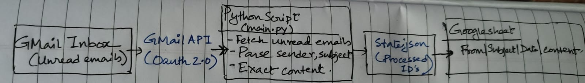

# 📧 Gmail to Google Sheets Automation (Python)

Author: Siddhartha Singh  
GitHub: https://github.com/DwightSchrute49

---

## 📌 Overview

This project is a Python automation system that connects to the Gmail API and Google Sheets API using OAuth 2.0 user consent. It reads real unread emails from a Gmail inbox and logs them into a Google Sheet.

Each email is processed only once, appended as a new row in Google Sheets, and then marked as read to avoid reprocessing.

---

## 🎯 Objective

For every qualifying email, a new row is added to Google Sheets with the following fields:

From – Sender email address  
Subject – Email subject  
Date – Date & time received  
Content – Email body (plain text)

---

## 🧠 High-Level Architecture Diagram

A hand-drawn architecture diagram is provided to visually explain the system flow.

Flow:
Gmail Inbox (Unread Emails)
→ Gmail API (OAuth 2.0)
→ Python Script (main.py)
↔ state.json (Processed Message IDs)
→ Google Sheets API
→ Google Sheet

---

## 🛠️ Tech Stack

Language: Python 3  
APIs Used:

- Gmail API
- Google Sheets API

Authentication: OAuth 2.0 (Installed Application flow)

Libraries:

- google-api-python-client
- google-auth
- google-auth-oauthlib
- beautifulsoup4

---

## 📂 Project Structure

gmail-to-sheets/
│
├── src/
│ ├── gmail_service.py
│ ├── sheets_service.py
│ ├── email_parser.py
│ └── main.py
│
├── credentials/
│ └── credentials.json (NOT COMMITTED)
│
├── proof/
│ ├── architecture_diagram.jpg
│ ├── gmail_unread.png
│ ├── sheet_populated.png
│ ├── oauth_consent.png
│ └── demo.mp4
│
├── .gitignore
├── requirements.txt
├── README.md
└── config.py

---

## ⚙️ Step-by-Step Setup Instructions

1. Clone the repository

git clone https://github.com/DwightSchrute49/gmail-to-sheets.git  
cd gmail-to-sheets

2. Install dependencies

pip install -r requirements.txt

3. Google Cloud Configuration

- Create a project in Google Cloud Console
- Enable Gmail API and Google Sheets API
- Configure OAuth consent screen (External)
- Add your Gmail address as a Test User
- Create OAuth Client ID (Desktop Application)
- Download credentials.json
- Place credentials.json inside the credentials/ folder

4. Google Sheets Setup

- Create a new Google Sheet
- Add headers: From | Subject | Date | Content
- Copy the Spreadsheet ID

5. Update Configuration

Edit config.py and set:

- Gmail and Sheets OAuth scopes
- Spreadsheet ID
- Sheet name

6. Run the script

python src/main.py

On the first run, a browser window will open requesting Google account authorization.

---

## 🔐 OAuth 2.0 Flow Used

This project uses OAuth 2.0 User Consent Flow.

Steps:

- User runs the script
- Browser opens Google Sign-In
- User grants Gmail and Sheets permissions
- OAuth access and refresh tokens are stored locally
- Tokens are reused on subsequent runs

OAuth is required because the application accesses private Gmail inbox data.

---

## 🔁 Email Scope Handling

- Reads emails from Inbox
- Processes unread emails only
- After successful processing, emails are marked as read
- On re-running the script, only new unread emails since the previous run are processed

---

## 🚫 Duplicate Prevention Logic

- Each Gmail email has a globally unique message ID
- Processed message IDs are stored locally
- Before processing an email:
  - If ID exists, the email is skipped
  - Otherwise, it is processed and stored

This ensures append-only behavior and prevents duplicate rows in Google Sheets.

---

## 🧠 State Persistence Method

State is stored in a local JSON file:

state.json

Why this approach:

- Simple and lightweight
- No external database required
- Persists across script runs
- Ensures idempotent execution

---

## 📸 Proof of Execution

All execution proof is available inside the proof/ folder:

- Hand-drawn architecture diagram
- Gmail inbox showing unread emails
- Google Sheet populated by the script
- OAuth consent screen with Gmail and Sheets permissions
- Screen recording explaining project flow, duplicate prevention, and re-run behavior

---

## 🚧 Challenges Faced & Solution

Challenge:
Emails were being logged multiple times when the script was run repeatedly.

Solution:
Implemented persistent state tracking using Gmail message IDs and marked emails as read after successful processing. This ensured each email is processed exactly once.

---

## ⚠️ Limitations

- Supports only a single Gmail account
- Requires manual OAuth authorization on first run
- State is stored locally and not suitable for distributed systems
- Attachments are not processed
- Only unread inbox emails are handled

---

## 🔄 Post-Submission Readiness

The codebase is modular and ready for future changes such as:

- Processing emails from the last 24 hours
- Adding Gmail labels as a new column
- Excluding automated or no-reply emails

---

## ✅ Conclusion

This project demonstrates real-world API integration, secure OAuth 2.0 usage, duplicate-safe automation design, and production-ready execution proof.

---

## 🏁 Submission Ready

Code pushed  
Secrets excluded  
Proof folder included  
README compliant with all assignment requirements
